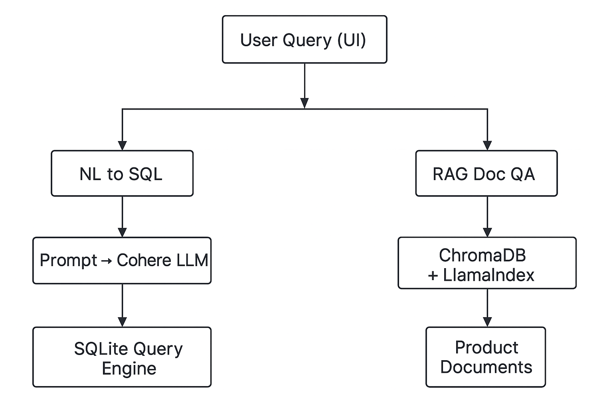

# 🧠 AI Assistant: Natural Language to SQL + Doc QA

An AI-powered assistant that understands natural language queries and:
- Fetches data from a transaction database (NL → SQL)
- Answers questions from internal product documents using RAG

---

## 🔧 Tech Stack

- Cohere LLM (Command R+)
- LlamaIndex
- ChromaDB
- Streamlit
- SQLite (dummy DB)

---

## ⚙️ Features

### 1. Ask the DB
- Converts user queries to SQL
- Executes on real SQLite DB
- Returns result in table

### 2. Ask the Docs
- Embeds product documents
- Retrieves relevant chunks using ChromaDB
- Answers grounded in real text

---

## 🧱 Architecture



---

## 📂 How to Run

1. Clone the repo
2. Create `.env` with your Cohere API Key
3. Run:
```bash
pip install -r requirements.txt
streamlit run app/app.py
```

---

## 🧪 Example Queries

### DB:
- Show failed transactions above ₹5000 in last 7 days

### Docs:
- What is the transaction limit of PaySecure+?

---

## 📌 License & Credits

MIT. Inspired by real-world GenAI work at enterprise scale.
